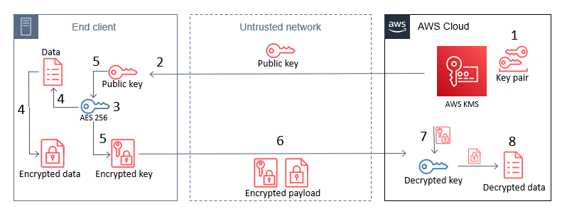

# AuthEncrypt-Lambda

**AuthEncrypt-Lambda** es un proyecto basado en AWS Lambda, AWS KMS, AWS DynamoDB, el framework de Serverless y nodejs para la ejecucion de javascript. Utiliza AWS Lambda para generar una llave publica en texto plano y una llave privada encriptada por medio de AWS KMS, partiendo de una maesta simetrica, para encriptar los los datos de usurio y contraseña y enviarlo de vuelta a la funcion lambda, para desepcritar y validar que los datos sean correctos en una tabla de AWS DynamoDB.

## Características

- Generación de llaves asincrónicas con AWS KMS.
- Encriptación de datos sensibles como usuario y contraseña.
- Validación de credenciales en una tabla de DynamoDB.
- Desplegable fácilmente con el framework Serverless.

## Requisitos previos

Antes de usar este proyecto, asegúrate de tener:

- Node.js (v18 o superior).
- Framework Serverless instalado globalmente: `npm install -g serverless`.
- AWS CLI configurado con las credenciales de acceso adecuadas.
- Permisos en AWS KMS y DynamoDB para las operaciones requeridas.

